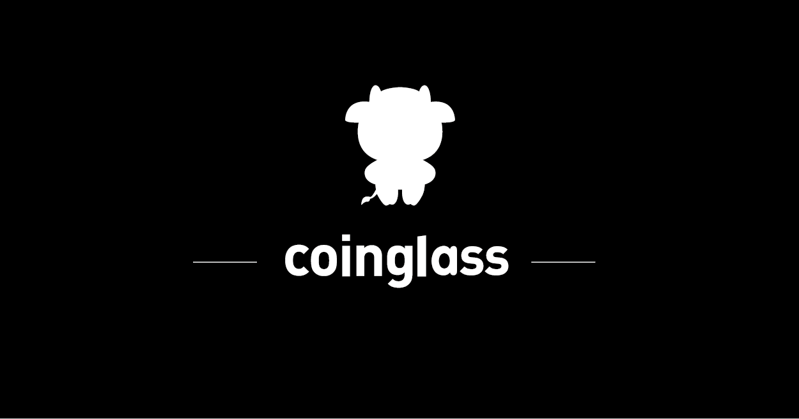
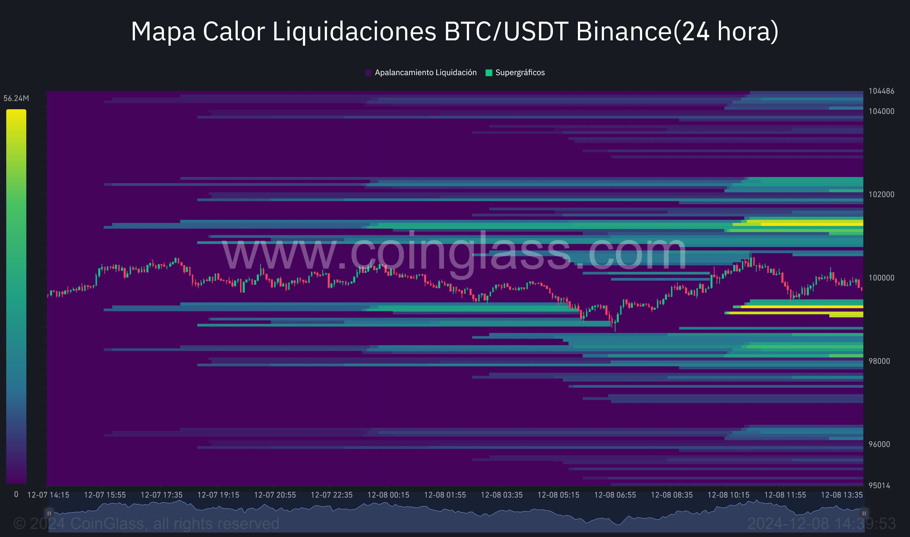
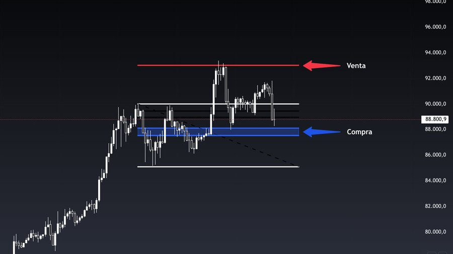
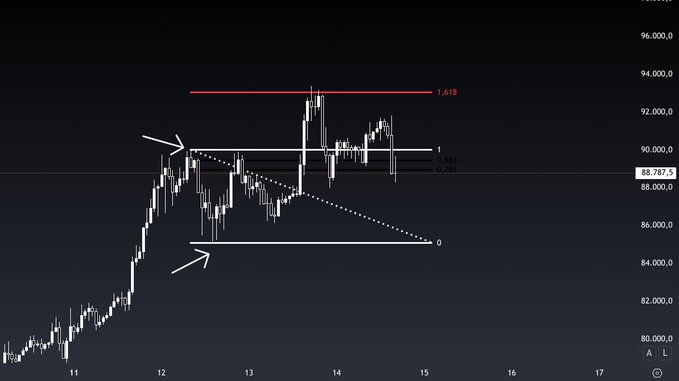
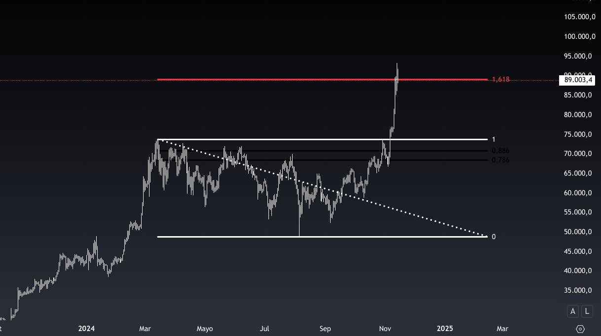
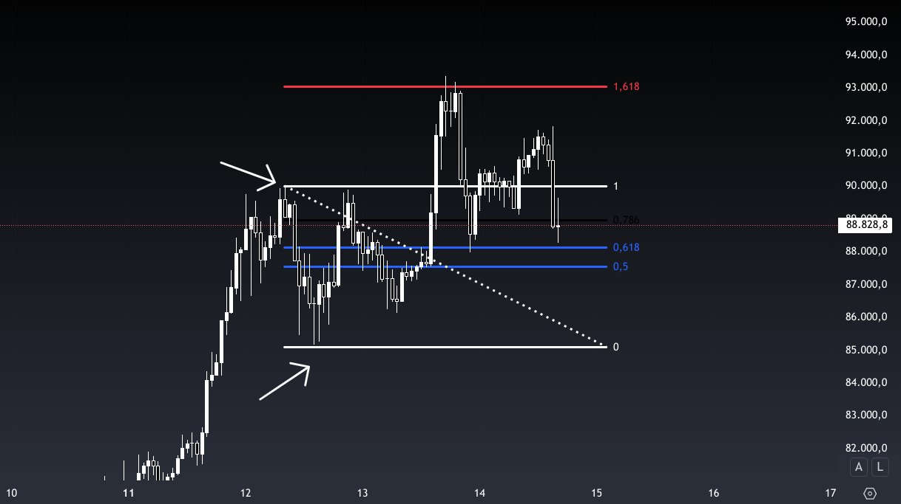
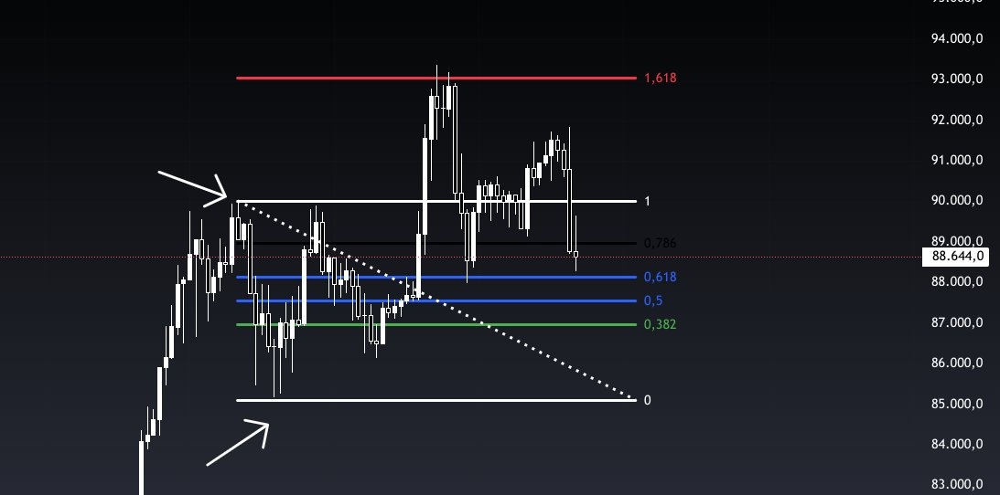

#  💸 10usdt x 10.000usdt 💸 Memecoins Snipper

Conceptos basicos y fundamentales de Bitcoin para entender el ecosistema.
Para finalmente desarrollar un Snipper dinamico abusando de cada aspecto posible

---

### 🕒 Apertura de Mercado

    - Open Drive - Movimiento claro y confiable.  
    - Open Test Drive - Confirmación necesaria.  
    - Open Rejection Reverse - Rechazo y reversión.  
    - Open Auction - Establecimiento de precios en subasta.

### 🔁 Rotación de Capital
    - Bitcoin Fuerte
    - Altcoins Fuerte
    - Corrección del Mercado
    - Mercado en Recuperación
    
### 📈 Flujos de Dinero y Altseason
    
    - Fase 1 - Bitcoin
    - Fase 2 - Ethereum
    - Fase 3 - Grandes Capitalizaciones
    - Fase 4 - Altseason

### 🛡️ Protección en Caídas del Mercado

    - La clave es proteger el capital 
    
### 🧩 Partes del Portafolio

    - Definir un pefil segun la fase para distintas categorias de riesgo.
    
### 📆 Determinar la tendencia dia a dia

    - Mempool
    - Coinglass
         - Ratio de Posiciones Largas y Cortas 
        - Mapa de Liquidaciones
            - para que sirve?

    - Analisis Tecnico   
    - Traiding View
        - Indicadores Personalizados
    - Analizar BTC en temporalidad de 1DIA
        - Fibbonacci
            - Extensiones de Fibonacci para Zonas de Venta
            - Retrocesos de Fibonacci para Zonas de Compra
        
### 🔎 Low Caps en Binance
    - ¿Cómo las encuentro ANTES de que pase?
    - Binance Labs como VC
    - Coinmarketcap 
    - Coingecko 
    - Narrativas

### 👁‍🗨 Trackear Ballenas
---

---

## 🕒 Apertura de Mercado

    🚀 Open Drive: Movimiento claro y confiable.  
    🔄 Open Test Drive: Confirmación necesaria.  
    🔁 Open Rejection Reverse: Rechazo y reversión.  
    🏛 Open Auction: Establecimiento de precios en subasta.

---

## 🔁 Rotación de Capital

El dinero se mueve entre estas fases dependiendo de las condiciones del mercado. La rotación de capital es esencial para optimizar el portafolio:

### 🌪️ Fases del Mercado
    
1️⃣ **Fase 1 - Bitcoin Fuerte**:  

    Si Bitcoin (BTC) está mostrando fuerza, se aumenta el porcentaje de capital en BTC.  
           - Acción: Rotar ganancias de altcoins hacia BTC.
       
2️⃣ **Fase 2 - Altcoins Fuerte**:  

    Si las altcoins están dominando, especialmente en el caso de MidCaps y LowCaps, se incrementan las posiciones en estas monedas.  
           - Acción: Rotar ganancias de BTC hacia altcoins más pequeñas.

3️⃣ **Fase 3 - Corrección del Mercado**:  

    En momentos de corrección, BTC es generalmente más resistente que las altcoins.  
           - Acción: Transferir parte de BTC a Liquidez y parte de las altcoins a BTC.

4️⃣ **Fase 4 - Mercado en Recuperación**:  
    
    Cuando el mercado se estabiliza y BTC toca suelo, se reinvierte en altcoins en el siguiente orden:  
           - BigCaps ➡️ MidCaps ➡️ LowCaps ➡️ Shitcoins

       

---

## 📈 Flujos de Dinero y Altseason

1️⃣ **Fase 1: Bitcoin**

       💰 El flujo de dinero entra en Bitcoin, causando aumentos en su precio.  
       💥 Ethereum lucha por seguir el ritmo de Bitcoin.

2️⃣ **Fase 2: Ethereum**

       🚀 Ethereum comienza a superar a Bitcoin, lo que genera especulación sobre el "flippening".

3️⃣ **Fase 3: Grandes Capitalizaciones**

       💸 El dinero fluye hacia altcoins de gran capitalización como BNB, ADA y SOL.  
       🔥 Las altcoins con fundamentos sólidos experimentan aumentos significativos.

4️⃣ **Fase 4: Altseason**

       📈 Las grandes capitalizaciones alcanzan picos parabólicos.  
       🤑 Las altcoins de todas las capitalizaciones (grandes, medianas y pequeñas) tienen aumentos masivos.  
       💬 Se genera una euforia generalizada con memes y criptomonedas menos fundamentales.

---

### 🛡️ Protección en Caídas del Mercado

La clave es proteger el capital en momentos de caída:

- **BTC** suele caer menos que las **altcoins**, por lo que, al rotar ganancias de las altcoins hacia BTC, se reduce el riesgo durante las caídas.
- **Liquidez** actúa como un refugio seguro durante tiempos de alta volatilidad.

---

## 🧩 Partes del Portafolio

Diferentes categorías, cada una con un perfil de riesgo y un enfoque específico según la fase del mercado:

| **Categoría**   | **Descripción**                                                                 | **Riesgo**    | **Momento de Inversión** |
|-----------------|---------------------------------------------------------------------------------|---------------|--------------------------|
| 💰 **Liquidez** | Capital en efectivo o stablecoins. Permite moverse rápidamente en el mercado.   | Bajo          | Siempre                  |
| 🟩 **BTC**      | Bitcoin, el activo más seguro y estable en el ecosistema cripto.                | Bajo          | En momentos de corrección o estabilidad |
| 🟦 **BigCaps**  | Criptomonedas de gran capitalización (Ethereum, Binance Coin).                  | Medio         | Cuando el mercado está relativamente estable |
| 🟨 **MidCaps**  | Criptomonedas con capitalización media. Potencial de alto crecimiento.         | Alto          | Cuando el mercado muestra señales de crecimiento |
| 🟪 **LowCaps**  | Criptomonedas de baja capitalización. Mayor volatilidad, más riesgo.            | Muy Alto      | En fases especulativas o de fuerte crecimiento |
| 🛑 **Shitcoins**| Criptomonedas sin valor fundamental. Especulativas y muy volátiles.            | Muy Alto      | Oportunidades a corto plazo |
| 🛠️ **Preventas**| Participación en preventas de tokens. Potencial de gran retorno.               | Alto          | Durante la fase de lanzamiento de proyectos |
| 🎨 **NFT**      | Tokens no fungibles, ideales para coleccionistas o arte digital.                | Alto          | Cuando hay tendencias en el mercado de arte digital |

---

### 📆 Determinar la tendencia dia a dia

---

## 🌐 **¿Qué es TradingView?**

Es una plataforma de gráficos y análisis que te permite visualizar datos en tiempo real de una amplia variedad de activos financieros, incluyendo criptomonedas, acciones, futuros y más. Además, ofrece herramientas para realizar análisis técnico avanzado, como:

- **Indicadores personalizados**.
- **Herramientas de dibujo** (líneas de tendencia, soportes, resistencias, etc.).
- **Alertas personalizadas**.
- **Gráficos interactivos**.

**TradingView** [aquí](https://www.tradingview.com).

---

## 💻 Mempool.space - Visualiza la Memoria de la Red Bitcoin

**Mempool.space** es una herramienta visual interactiva para monitorear el estado de la red de Bitcoin en tiempo real. Muestra cómo las transacciones pendientes (mempool) se acumulan y cómo los mineros las procesan en los bloques de la cadena. 

- 🔥 **Monitoreo en tiempo real**
- 💸 **Estimación de tarifas**
- 🧑‍🔬 **Gráficos interactivos**
- ⏳ **Confirmaciones rápidas**

**Enlace:** [Mempool.space](https://mempool.space/es/)

---

# 📊 Coinglass - Herramientas de Análisis 

Coinglass es una plataforma avanzada de análisis de datos para criptomonedas, que proporciona herramientas clave para traders e inversores. Estas herramientas te permiten monitorear la actividad del mercado de futuros, analizar el sentimiento del mercado y comprender las dinámicas de liquidación de posiciones. Entre sus herramientas más útiles se encuentran el **Liquidation Heat Map** y el **Long/Short Ratio**.

## 🛠️ Liquidation Heat Map (Mapa de Liquidaciones)

- 🔴 **Áreas rojas**
- 🟢 **Áreas verdes**
- 🟡 **Áreas amarillas**
- 📊 **Visualización interactiva**
  
**Enlace:** [Liquidation Heat Map en Coinglass](https://www.coinglass.com/es/pro/futures/LiquidationHeatMap)

---

## 📈 Long/Short Ratio (Ratio de Posiciones Largas y Cortas)

- 📊 **Ratio L/P**
- 🔼 **Posiciones largas**
- 🔽 **Posiciones cortas**
- 📉 **Tendencias del mercado**

**Enlace:** [Long/Short Ratio en Coinglass](https://www.coinglass.com/es/LongShortRatio)

---

# 📚 $BTC: Detectar Zonas de Venta y Compra con Fibonacci

Cómo identificar zonas clave para vender y re-comprar Bitcoin durante una tendencia alcista, utilizando las herramientas de **Fibonacci**. Esto te permitirá mejorar tu análisis técnico de forma sencilla.

---

## 1️⃣ **Extensiones de Fibonacci para Zonas de Venta** 

Para detectar zonas de venta en una tendencia alcista:

- Traza el **Fibonacci** desde el máximo hasta el mínimo de la corrección (línea de puntos).
- Configura el nivel **1.618** de Fibonacci en los ajustes.

**Ejemplos:**
- **Zona actual** (temporalidad baja).
- **Rango previo a la ruptura**.

---

## 2️⃣ **Retrocesos de Fibonacci para Zonas de Compra**

Para detectar zonas de compra durante una corrección alcista:

- Usa el mismo rango de Fibonacci que en el anterior post.
- Configura los niveles **0.618** y **0.5** de Fibonacci.
  
**Nota:**  
Normalmente el precio reaccionará en la zona entre **0.5** y **0.618** en el retroceso durante una tendencia alcista.

---

## 🔷 **Recordatorio Importante**

- En **Análisis Técnico** siempre hablamos de **estadística** y **probabilidad**, no es una ciencia exacta.
- Otro nivel importante a vigilar es el **0.382**, donde en ocasiones las correcciones también se pueden extender hasta esa zona.

---
