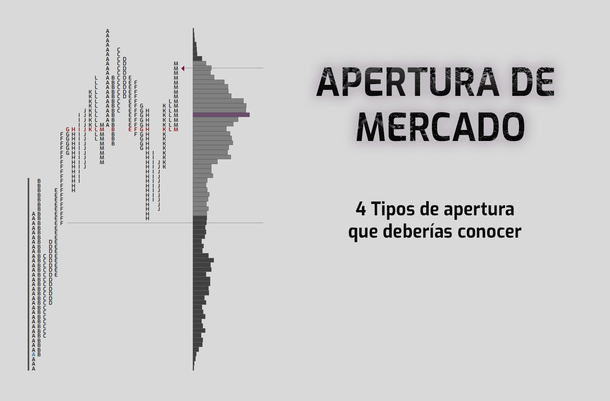
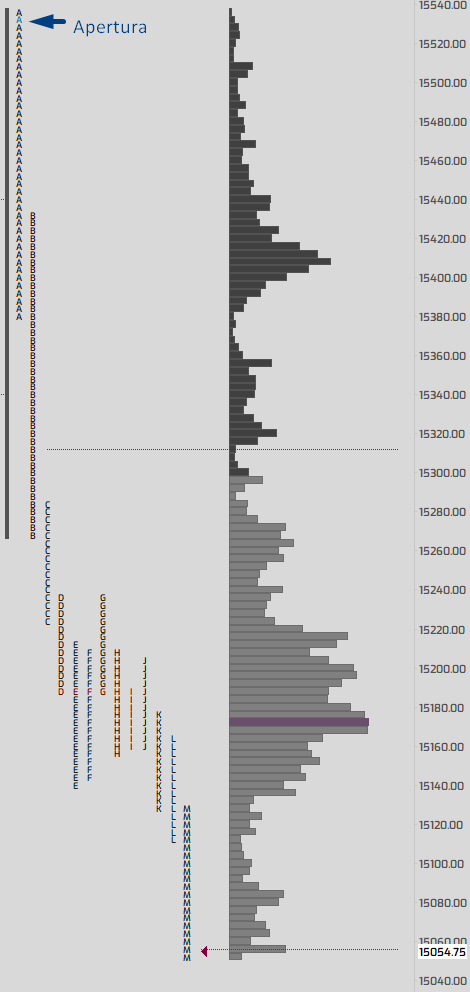
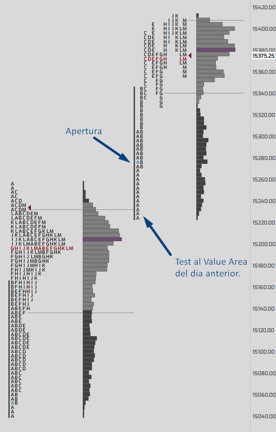
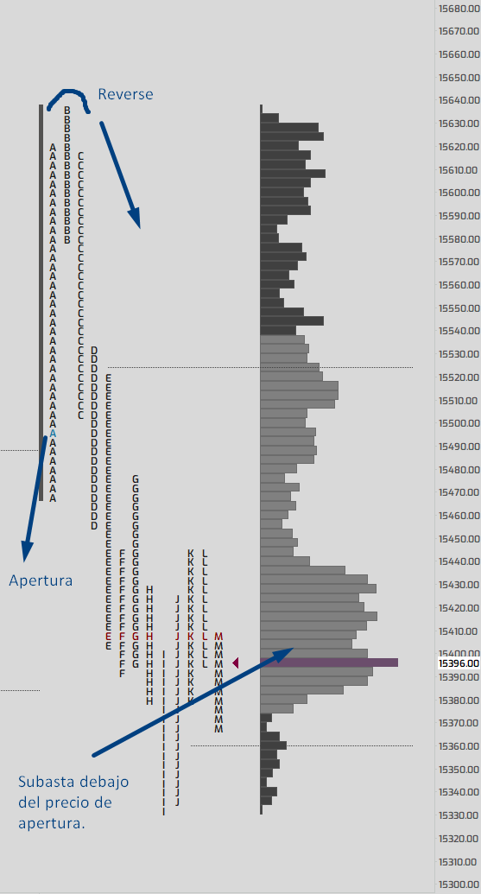
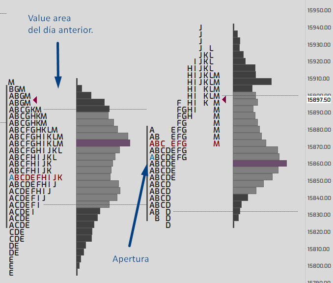

 

---

# 📚 Aprender sobre **Market Profile**: **Apertura de Mercado**

Esta seccion cubre los conceptos clave relacionados con la **Apertura de Mercado** en el análisis de **Market Profile**. Aprende sobre los diferentes patrones que se forman en la apertura y cómo analizarlos para mejorar tus decisiones de trading.

 

## 🕒 **Apertura de Mercado**

La **apertura** es uno de los momentos más cruciales para los traders. Durante esta fase, los traders ajustan sus perspectivas sobre la administración y apertura de posiciones, esperando señales clave que determinen la dirección futura del mercado.

## 🔍 Contexto de la Apertura

El **contexto** es vital. Cuanto más **confianza** se vea en la subasta durante la apertura, mayores son las probabilidades de que el mercado continúe en esa dirección.

### Características a observar:

- **Confianza**: La subasta debe mostrar consistencia.
- **Dirección**: Si el contexto es fuerte, el mercado probablemente se moverá en esa dirección.

---

## 💡 4 Patrones de Apertura

Existen 4 patrones clave en la apertura del mercado que los traders deben identificar para mejorar su análisis y toma de decisiones. Aquí te los explico de forma clara y concisa:

| 📊 **Patrón**                 | 📝 **Descripción**                                                                                            | 🔑 **Características**                                                                                                       |
| ----------------------------- | ------------------------------------------------------------------------------------------------------------- | ---------------------------------------------------------------------------------------------------------------------------- |
| 🚀 **Open Drive**             | **Apertura más convincente**, donde los participantes influyentes lideran el movimiento del mercado.          | - Pocas probabilidades de revisar precios de apertura.   - Dirección clara y fuerte del mercado.                          |
| 🔄 **Open Test Drive**        | Fuerte convicción, pero el mercado necesita **testear** un nivel antes de continuar con la iniciativa.        | - Necesita confirmación en un nivel.   - Similar al Open Drive pero con una **pausa** para evaluar el mercado.            |
| 🔁 **Open Rejection Reverse** | El mercado **rechaza** la dirección inicial de apertura y revierte su curso.                                  | - Movimiento inicial en una dirección, pero luego **inversión** de la tendencia.   - Participantes influyentes reactivan. |
| 🏛 **Open Auction**            | Apertura más **lenta** y lateral, donde el mercado está en una **subasta** para encontrar el precio adecuado. | - **Subasta** en el mercado para establecer precios.   - Menos decisivo, pero importante para evaluar el equilibrio.      |

---

## 🎯 ¿Cómo analizar estos patrones?

El análisis de la **apertura** debe enfocarse en detectar el tipo de patrón que se forma en ese momento. Observar cómo el mercado reacciona en los primeros minutos o en las primeras horas puede darte pistas importantes sobre la dirección y las decisiones de otros traders.

---

### 1. Open Drive

- **Descripción:** Es la apertura más convincente y dinámica.
- **Características:**
  - Los **participantes influyentes** toman la iniciativa y empujan el mercado en una dirección clara.
  - Existen **pocas probabilidades** de que el mercado revierta y vuelva a los precios de apertura.
  
---

### 2. Open Test Drive

- **Descripción:** Similar al Open Drive, pero el mercado necesita **testear** un nivel específico antes de continuar con la iniciativa.
- **Características:**
  - Existe una fuerte convicción inicial, pero los precios deben probarse en un nivel específico antes de continuar con la iniciativa.
  - La dinámica inicial es sólida, pero los traders buscan **confirmación** para continuar.

---

### 3. Open Rejection Reverse

- **Descripción:** Este patrón se presenta cuando el mercado **rechaza** la dirección inicial de apertura y luego invierte su curso.
- **Características:**
  - El mercado se mueve en una dirección, pero rápidamente **revierte** su tendencia a medida que los traders reevalúan la situación.
  - Los **participantes influyentes** entran en el mercado para invertir el movimiento y cambiar la dirección.

---

### 4. Open Auction

- **Descripción:** Se caracteriza por una apertura más **lenta**, donde el mercado está en proceso de subasta para determinar el precio adecuado.
- **Características:**
  - La acción del precio es más **lateral** al principio, y los traders evalúan el precio antes de tomar decisiones.
  - Este patrón es menos decisivo en comparación con otros, pero puede proporcionar valiosa información sobre el nivel de equilibrio entre compradores y vendedores.

---

## 🖼 Imágenes de los Patrones de Apertura

A continuación, se presentan las imágenes representativas de los patrones de apertura en el Market Profile:

<table>
  <tr>
    <td></td>
    <td></td>
  </tr>
  <tr>
    <td></td>
    <td></td>
  </tr>
</table>

---

## 🎯 ¿Cómo analizar estos patrones?

El análisis de la **apertura** debe enfocarse en detectar el tipo de patrón que se forma en ese momento. Observar cómo el mercado reacciona en los primeros minutos o en las primeras horas puede darte pistas importantes sobre la dirección y las decisiones de otros traders.

---

## 🧠 Resumen

La apertura del mercado es uno de los momentos más **críticos** para los traders. Estos patrones ayudan a anticipar movimientos, y comprenderlos te dará una ventaja en la toma de decisiones. Aquí tienes una clave para cada patrón:

- 🚀 **Open Drive**: Movimiento claro y confiable.
- 🔄 **Open Test Drive**: Confirmación necesaria.
- 🔁 **Open Rejection Reverse**: Rechazo y reversión.
- 🏛 **Open Auction**: Establecimiento de precios en subasta.

---
