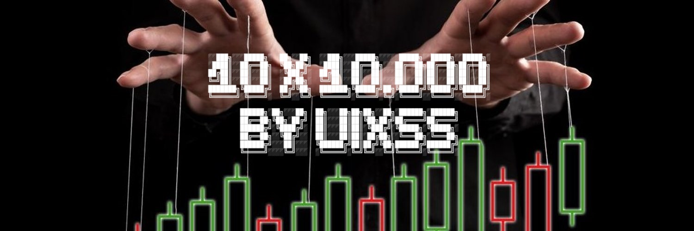
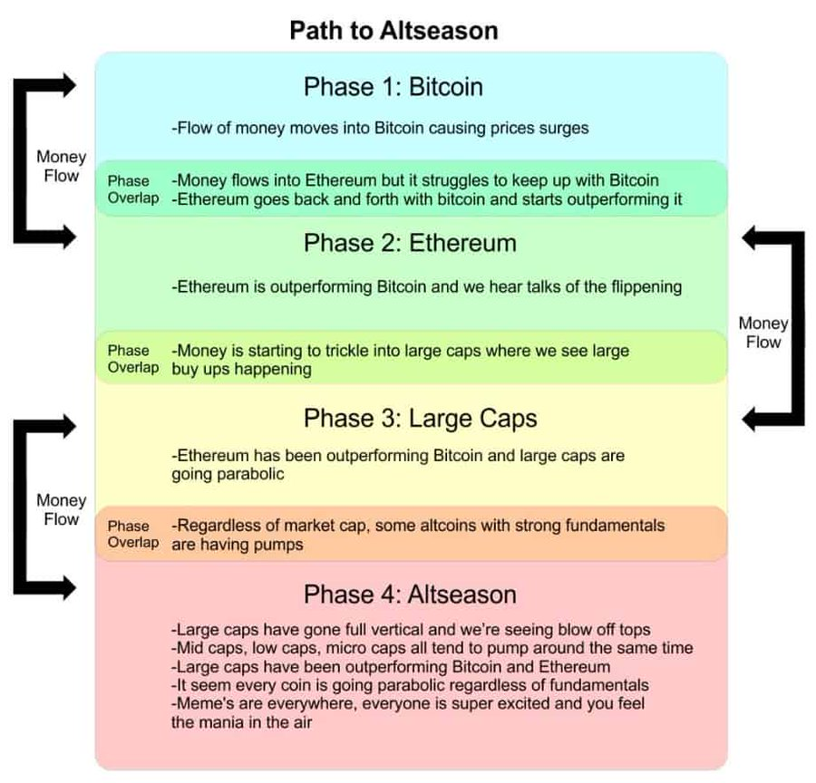
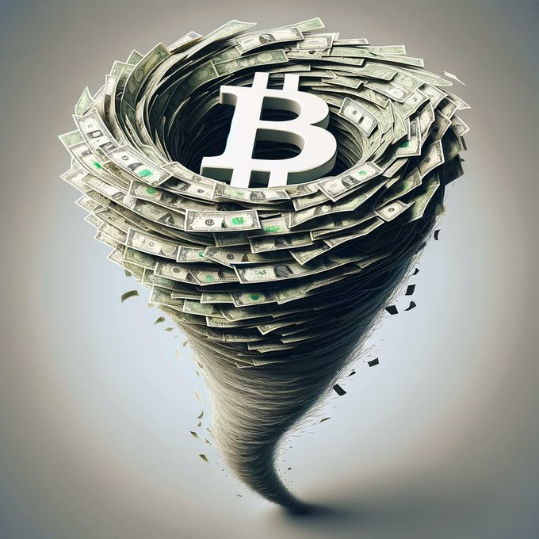
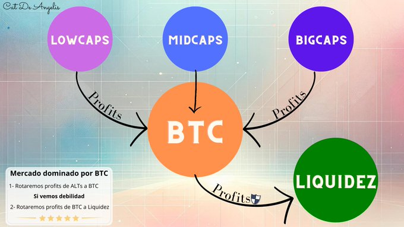
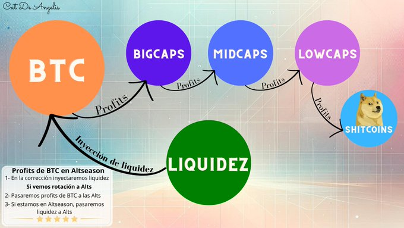
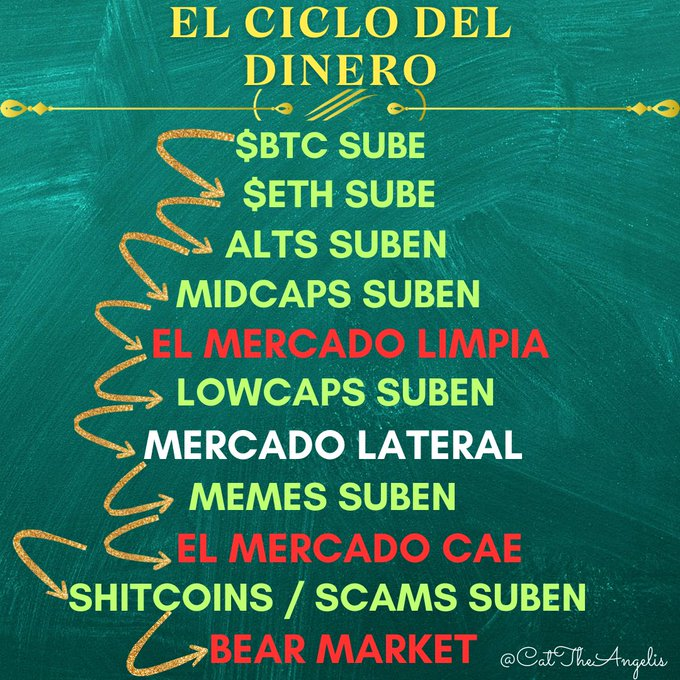

 

---

## 🕒 Apertura de Mercado

    🚀 Open Drive: Movimiento claro y confiable.
    🔄 Open Test Drive: Confirmación necesaria.
    🔁 Open Rejection Reverse: Rechazo y reversión.
    🏛 Open Auction: Establecimiento de precios en subasta.

---

## 📈 Flujos de Dinero y Altseason

  1️⃣ Fase 1: Bitcoin
  
      💰 El flujo de dinero entra en Bitcoin, causando aumentos en su precio.
      💥 Ethereum lucha por seguir el ritmo de Bitcoin.
  
  2️⃣ Fase 2: Ethereum
  
      🚀 Ethereum comienza a superar a Bitcoin, lo que genera especulación sobre el "flippening".
  
  3️⃣ Fase 3: Grandes Capitalizaciones
  
      💸 El dinero fluye hacia altcoins de gran capitalización como BNB, ADA y SOL.
      🔥 Las altcoins con fundamentos sólidos experimentan aumentos significativos.
  
  4️⃣ Fase 4: Altseason
  
      📈 Las grandes capitalizaciones alcanzan picos parabolicos.
      🤑 Las altcoins de todas las capitalizaciones (grandes, medianas y pequeñas) tienen aumentos masivos.
      💬 Se genera una euforia generalizada con memes y criptomonedas menos fundamentales.

---

  ## 🧩 Partes del Portafolio
  
  El portafolio se divide en diferentes categorías, cada una con un perfil de riesgo y un enfoque específico según la fase del mercado:
  
  | **Categoría**   | **Descripción**                                                                 | **Riesgo**    | **Momento de Inversión** |
  |-----------------|---------------------------------------------------------------------------------|---------------|--------------------------|
  | 💰 **Liquidez** | Capital en efectivo o stablecoins. Permite moverse rápidamente en el mercado.   | Bajo          | Siempre                  |
  | 🟩 **BTC**      | Bitcoin, el activo más seguro y estable en el ecosistema cripto.                | Bajo          | En momentos de corrección o estabilidad |
  | 🟦 **BigCaps**  | Criptomonedas de gran capitalización (Ethereum, Binance Coin).                  | Medio         | Cuando el mercado está relativamente estable |
  | 🟨 **MidCaps**  | Criptomonedas con capitalización media. Potencial de alto crecimiento.         | Alto          | Cuando el mercado muestra señales de crecimiento |
  | 🟪 **LowCaps**  | Criptomonedas de baja capitalización. Mayor volatilidad, más riesgo.            | Muy Alto      | En fases especulativas o de fuerte crecimiento |
  | 🛑 **Shitcoins**| Criptomonedas sin valor fundamental. Especulativas y muy volátiles.            | Muy Alto      | Oportunidades a corto plazo |
  | 🛠️ **Preventas**| Participación en preventas de tokens. Potencial de gran retorno.               | Alto          | Durante la fase de lanzamiento de proyectos |
  | 🎨 **NFT**      | Tokens no fungibles, ideales para coleccionistas o arte digital.                | Alto          | Cuando hay tendencias en el mercado de arte digital |
  
  ## 🔁 Rotación de Capital
  
  
  
  ### 🌪️ Fases del Mercado
  
  El dinero se mueve entre estas fases dependiendo de las condiciones del mercado. La rotación de capital es esencial para optimizar el portafolio:
  
  1. **Fase 1 - Bitcoin Fuerte**:  
     Si **Bitcoin** (BTC) está mostrando fuerza, se aumenta el porcentaje de capital en BTC.
     - **Acción**: Rotar ganancias de altcoins hacia BTC.
     - 
  
  
  2. **Fase 2 - Altcoins Fuerte**:  
     Si las **altcoins** están dominando, especialmente en el caso de **MidCaps** y **LowCaps**, se incrementan las posiciones en estas monedas.
     - **Acción**: Rotar ganancias de BTC hacia altcoins más pequeñas.
  
  
  
  3. **Fase 3 - Corrección del Mercado**:  
     En momentos de corrección, BTC es generalmente más resistente que las altcoins.
     - **Acción**: Transferir parte de BTC a **Liquidez** y parte de las **altcoins** a BTC.
  
  
  
  4. **Fase 4 - Mercado en Recuperación**:  
     Cuando el mercado se estabiliza y BTC toca suelo, se reinvierte en **altcoins** en el siguiente orden:
     - **BigCaps** ➡️ **MidCaps** ➡️ **LowCaps** ➡️ **Shitcoins**
  
  
  ### 🛡️ Protección en Caídas del Mercado
  
  La clave es proteger el capital en momentos de caída:
  
  - **BTC** suele caer menos que las **altcoins**, por lo que, al rotar ganancias de las altcoins hacia BTC, se reduce el riesgo durante las caídas.
  - **Liquidez** actúa como un refugio seguro durante tiempos de alta volatilidad.

---

